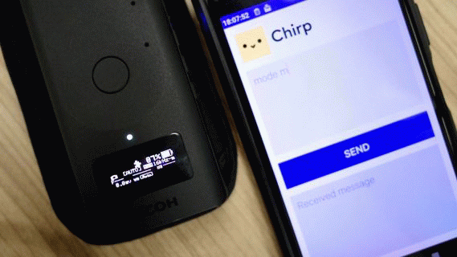

# Chirp Remote

Japanese page [here](README_jp.md)

## Overview

This THETA plug-in is [Powered by Chirp](http://www.chirp.io).
Using this THETA plug-in, you can remotely control THETA by sound communication using the Asio Ltd. Chirp library.

You can control THETA by sound communication in the following two ways.

1. Using the “Chirp Messenger” app released by Asio Ltd. for smartphones, send the command string shown in the “List of commands” chapter.<br>
  For Android: https://play.google.com/store/apps/details?id=io.chirp.messenger<br>
  For iOS: https://apps.apple.com/app/chirp-messenger/id1438119896<br>



2. Play music files in mp3 or wav format that can be downloaded from the ["audiofiles"](./audiofiles/) folder in this repository on various audio players.


Chirp supports protocols with multiple frequencies.
Among them, this THETA plug-in can use the following three types of protocols.

- "16kHz-mono" (audible sound)
- "Ultrasonic" (frequency that many people cannot hear)
- "Standard" (audible sound)


The application “Chirp Messenger” released for smartphones by Asio Ltd. supports only the protocol of “16kHz-mono”.
If you want to use "Chirp Messenger" with other protocols, please rebuild and use the source code published by Asio Ltd. <br>
  For Android: https://github.com/chirp/chirp-android-examples#kotlin <br>
  For iOS: https://github.com/chirp/chirp-ios-examples/tree/master/Swift/Messenger <br>
You can also refer to the “About building this source code” chapter of this document for user registration and protocol selection.

If you want to create your own music files, see [here](https://developers.chirp.io/docs/tutorials/command-line).


## List of commands

The command is in the format of “command character string + single-byte space + argument”.
(Example: If you want to specify -0.3 for exposure compensation, it will be "ev -0.3")

|Command<br>&nbsp;&nbsp;&nbsp;&nbsp;&nbsp;&nbsp;&nbsp;&nbsp;&nbsp;&nbsp;&nbsp;&nbsp;&nbsp;&nbsp;&nbsp;&nbsp;&nbsp;&nbsp;&nbsp;&nbsp;&nbsp;&nbsp;|Value<br>&nbsp;&nbsp;&nbsp;&nbsp;&nbsp;&nbsp;&nbsp;&nbsp;&nbsp;&nbsp;&nbsp;&nbsp;&nbsp;&nbsp;&nbsp;&nbsp;&nbsp;&nbsp;&nbsp;&nbsp;&nbsp;&nbsp;&nbsp;&nbsp;&nbsp;&nbsp;&nbsp;&nbsp;&nbsp;&nbsp;&nbsp;&nbsp;&nbsp;&nbsp;&nbsp;&nbsp;&nbsp;&nbsp;&nbsp;&nbsp;&nbsp;&nbsp;|Description<br>&nbsp;|
|---|---|---|
| tp | None | Shooting Trigger <br> Same as shutter <br> 'tp' is an abbreviation for 'take picture' |
| shutter | None| Shooting Trigger <br> Same as tp |
| mode | None/+/-/ <br>p/av/tv/iso/m | Specify the exposure program. <br> If there is no value, the current value is returned. <br> 'av' is only valid for Z1. |
| ev | None/+/-/ <br> Numbers defined in the webAPI specification [exposureCompensation](https://api.ricoh/docs/theta-web-api-v2.1/options/exposure_compensation/) . | Specify the exposure compensation value. <br> If there is no value, the current value is returned. |
| ss | None/+/-/ <br> <br> -For more than 1 second <br> webAPI specification [shutterSpeed](https://api.ricoh/docs/theta-web-api-v2.1/options/shutter_speed/) A character string with "" (double quotes) "appended after the numerical value. <br> (Example: 1sec = 1") <br> <br>-If shorter than 1 second <br> webAPI specification [shutterSpeed](https://api.ricoh/docs/theta-web-api-v2.1/options/shutter_speed/) Numeric denominator only. <br> (Example: 1/1000sec = 1000) | Specify shutter speed. <br> If no value, current value Returns |
| iso | None/+/-/ <br> Numeric value defined in webAPI specification [iso](https://api.ricoh/docs/theta-web-api-v2.1/options/iso/) . | Specify the ISO sensitivity. <br> If there is no value, the current value is returned. |
| f | None/+/-/ <br> Numeric value defined in webAPI specification [aperture](https://api.ricoh/docs/theta-web-api-v2.1/options/aperture/) . | Specify the aperture value. <br> If there is no value, the current value is returned. <br> Valid only with Z1. |
| wb | None/+/-/ <br> <br>-For preset WB <br>auto/day/shade/cloud/lamp1/lamp2/fluo1/fluo2/fluo3/fluo4<br> <br>-For Color temperature <br> Numerical value of color temperature defined in the webAPI specification [_colorTemperature] (https://api.ricoh/docs/theta-web-api-v2.1/options/_color_temperature/).<br> | Specify the white balance. <br> If there is no value, the current value is returned. <br> Depending on the value, you can choose between preset white balance and color temperature specification. |
| timer | Any number between 0 and 10. | Specifies the behavior of the timer. <br> If 0 is specified, the timer is turned off. |
| ts | on / off | Specify whether or not to use time shift shooting. |
| reply | t / f <br> or <br> e / d | You can select whether or not to respond with Chirp from THETA. <br> t / f means true / false and e / d means enable / disable. |

Note: This plug-in uses a microphone to wait for command reception via Chirp (sound communication), so it cannot record movies.


## Response message specification

You can also receive a response from THETA by typing a command on THETA using the smartphone sample app "Chirp Messenger". However,

- There is no response to the shooting instructions “shutter” and “tp”.
- There is also no “reply f” or “reply d” response (because it is a command that makes no response)

The response string specifications are summarized below.

### When Chirp protocol is "16kHz-mono" or "standard"
The format changes depending on the exposure program.
Each is as follows.

| Exposure Program | Response String Format |
| --- | --- |
| AUTO |AUTO [Exposure compensation value] ev[White balance] ['ts' when TimeShift is on]|
| Aperture priority <br> (Z1 only) |Av [Exposure compensation value]ev F[Aperture value] [White balance] ['ts' when TimeShift is on] |
| Shutter speed priority |Tv [Exposure compensation value]ev ss[Shutter speed] [White balance] ['ts' when TimeShift is on] |
| ISO sensitivity priority |Av [Exposure compensation value]ev iso[ISO sensitivity] [White balance] ['ts' when TimeShift is on] |
| MANUAL |MANU F[Aperture value] [Shutter speed] [ISO sensitivity] [White balance] ['ts' when TimeShift is on] |


### When Chirp protocol is "ultrasonic"

The parameters in the “Value” column of the “List of commands” table are returned.

### When THETA recognizes an error

| String | description |
| --- | --- |
| UndefCmd | Undefined command |
| SplitERR | There are 3 or more blocks separated by spaces |
| Len ERR | Received a character string of 8 bytes or more |
| BUSY | THETA BUSY (just after shooting) |
| ParamERR | Incorrect parameter (value) |
| Can'tSET | A command that cannot be executed in the current exposure program has been received |
| COM ERR | WebAPI communication error inside THETA |
| Mode ERR | Shutter / ts command was sent during video mode (for debugging) |


## Button operation

|Button name<br>&nbsp;&nbsp;&nbsp;&nbsp;&nbsp;&nbsp;&nbsp;&nbsp;&nbsp;&nbsp;&nbsp;&nbsp;&nbsp;&nbsp;&nbsp;&nbsp;&nbsp;&nbsp;&nbsp;&nbsp;&nbsp;&nbsp;&nbsp;|Short press<br>&nbsp;&nbsp;&nbsp;&nbsp;&nbsp;&nbsp;&nbsp;&nbsp;&nbsp;&nbsp;&nbsp;&nbsp;&nbsp;&nbsp;&nbsp;&nbsp;&nbsp;&nbsp;&nbsp;&nbsp;&nbsp;&nbsp;&nbsp;&nbsp;&nbsp;&nbsp;&nbsp;&nbsp;&nbsp;&nbsp;|Long press<br>&nbsp;&nbsp;|
|---|---|---|
| Shutter | Shooting | None |
| WLAN | WLAN On / Off | Switches the protocol (communication frequency) of chirp. |
| Mode | timeshift On / Off | End plug-in <br> * Button operation assignment cannot be changed. |
| Fn <br> (Z1 only) | Timer On / Off | Switches whether or not to respond with Chirp from the THETA main unit. |


## Information to be saved when the plug-in ends

The following information is saved when you close the plug-in and is used the next time you start the plug-in.

- Chirp protocol (16kHz-mono / ultrasonic / standard).
- Choice of whether or not to respond with Chirp from THETA itself.
- Choice of whether or not to perform time shift shooting.


## About building this source code

Please register as a user according to [this page](https://developers.chirp.io/applications), and write your credentials in the appropriate part of the source code before building.

Acquire the “CHIRP_APP_CONFIG” key information for each of the three frequencies, and enter them in the following locations in MainActivity.java.

```java:MainActivity.java
    //16kHz-mono
    String CHIRP_APP_CONFIG_16K_MONO = "Please set the CHIRP_APP_CONFIG key for the '16kHz-mono' protocol.";
    //ultrasonic
    String CHIRP_APP_CONFIG_US = "Please set the CHIRP_APP_CONFIG key for the 'ultrasonic' protocol.";
    //standard
    String CHIRP_APP_CONFIG_STD = "Please set the CHIRP_APP_CONFIG key for the 'standard' protocol.";
```


## Development Environment

### Camera
* RICOH THETA Z1 Firmware ver.1.11.1 and above
* RICOH THETA V Firmware ver.3.06.1 and above

### SDK/Library
* RICOH THETA Plug-in SDK ver.2.0.10
* Chirp SDK Version: Chirp SDK 3.10.0 [3.3.1 1403]

### Development Software
* Android Studio ver.3.4.2
* gradle ver.5.1.1


## License

```
Copyright 2018 Ricoh Company, Ltd.

Licensed under the Apache License, Version 2.0 (the "License");
you may not use this file except in compliance with the License.
You may obtain a copy of the License at

    http://www.apache.org/licenses/LICENSE-2.0

Unless required by applicable law or agreed to in writing, software
distributed under the License is distributed on an "AS IS" BASIS,
WITHOUT WARRANTIES OR CONDITIONS OF ANY KIND, either express or implied.
See the License for the specific language governing permissions and
limitations under the License.
```

## Contact


