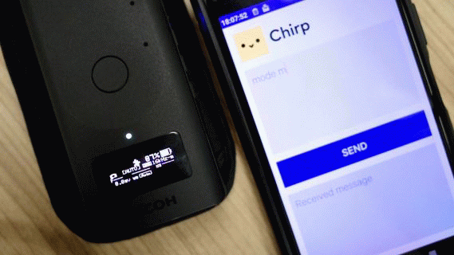

# Chirp Remote

English page [here](README.md)

## Overview

このTHETAプラグインは[Chirpを使用しています](http://www.chirp.io)。
このTHETAプラグインを使うと、Asio Ltd. Chirpライブラリによる音通信によってTHETAをリモート操作できるようになります。

以下2通りの方法で音通信によるTHETAの制御が行えます。

1. Asio Ltd.がスマートフォン用にリリースしているアプリ「Chirp Messenger」を利用して、「List of commands」の章に示すコマンド文字列を送信する。<br>
 Android用:https://play.google.com/store/apps/details?id=io.chirp.messenger<br>
 iOS用:https://apps.apple.com/jp/app/chirp-messenger/id1438119896<br>



2. 本リポジトリの[「audiofiles」](./audiofiles/)フォルダからダウンロードできる mp3形式 または wav形式の音楽ファイルを、各種オーディオプレーヤーで再生する。


Chirpは複数の周波数によるプロトコルに対応しています。
それらの中で、本THETAプラグインが利用できるプロトコルは以下の3種類です。

- 「16kHz-mono」（可聴音です）
- 「ultrasonic」（多くの人が聴き取れない周波数です）
- 「standard」（可聴音です）

Asio Ltd.がスマートフォン用にリリースしているアプリ「Chirp Messenger」は、「16kHz-mono」のプロトコルのみに対応しています。
他のプロトコルで「Chirp Messenger」を利用したい場合には、Asio Ltd.が公開しているソースコードをビルドしなおして利用してください。<br>
 Android用:https://github.com/chirp/chirp-android-examples#kotlin<br>
 iOS用:https://github.com/chirp/chirp-ios-examples/tree/master/Swift/Messenger<br>
ユーザー登録方法とプロトコルの選択方法に関しては、この文書の「About building this source code」の章も参考になります。

独自に音楽ファイルを生成する場合には、[こちら](https://developers.chirp.io/docs/tutorials/command-line)を参照してください。


## List of commands

コマンドは「コマンド文字列+半角スペース+値」の形式です。
(例:露出補正を-0.3に指定したい場合には「ev -0.3」となります)

|コマンド<br>&nbsp;&nbsp;&nbsp;&nbsp;&nbsp;&nbsp;&nbsp;&nbsp;&nbsp;&nbsp;&nbsp;&nbsp;&nbsp;&nbsp;&nbsp;&nbsp;|値<br>&nbsp;|説明<br>&nbsp;|
|---|---|---|
|tp|なし|撮影のトリガー<br>shutterと同じ<br>’tp’は’take picture’を略した文字列|
|shutter|なし|撮影のトリガー<br>tpと同じ|
|mode|なし/+/-/<br>p/av/tv/iso/m|露出プログラムを指定します。<br>値なしの場合、現在の値を返します。<br>'av'はZ1でのみ有効です。|
|ev|なし/+/-/<br>webAPIの仕様書 [exposureCompensation](https://api.ricoh/docs/theta-web-api-v2.1/options/exposure_compensation/)で定義された数値。|露出補正値を指定します。<br>値なしの場合、現在の値を返します。|
|ss|なし/+/-/<br><br>・1秒以上の場合<br>webAPIの仕様書 [shutterSpeed](https://api.ricoh/docs/theta-web-api-v2.1/options/shutter_speed/)で定義された数値の後ろに「"（ダブルクォート）」を付与した文字列。<br>(例:1sec=1")<br><br>・1秒より短い場合<br>webAPIの仕様書 [shutterSpeed](https://api.ricoh/docs/theta-web-api-v2.1/options/shutter_speed/)で定義された数値の分母のみ。<br>(例:1/1000sec=1000)|シャッター速度を指定します。<br>値なしの場合、現在の値を返します。|
|iso|なし/+/-/<br>webAPIの仕様書 [iso](https://api.ricoh/docs/theta-web-api-v2.1/options/iso/)で定義された数値。|ISO感度を指定します。<br>値なしの場合、現在の値を返します。|
|f|なし/+/-/<br>webAPIの仕様書 [aperture](https://api.ricoh/docs/theta-web-api-v2.1/options/aperture/)で定義された数値。|絞り値を指定します。<br>値なしの場合、現在の値を返します。<br>Z1でのみ有効です。|
|wb|なし/+/-/<br><br>・プリセットWBの場合<br>auto/day/shade/cloud/lamp1/lamp2/fluo1/fluo2/fluo3/fluo4<br><br>・色温度の場合<br>webAPIの仕様書 [_colorTemperature](https://api.ricoh/docs/theta-web-api-v2.1/options/white_balance/)で定義された色温度の数値。<br>|ホワイトバランスを指定します。<br>値なしの場合、現在の値を返します。<br>値により、プリセットホワイトバランスと色温度指定のいずれかを選択することができます。|
|timer|0～10までの数値のいずれか|タイマーの振る舞いを指定します。<br>0を指定するとタイマーOFFとなります。|
|ts|on / off|タイムシフト撮影をする/しないを指定します。|
|reply|t / f<br>または<br>e / d|THETA本体からChirpでの応答をする/しないを選択できます。<br>t/fはtrue/false、e/dはenable/disableの意味です。|

注意:本プラグインは、Chirp（音通信）によるコマンド受信待ちにマイクを利用するため、動画の記録が行えません。


## Response message specification

スマートフォン用サンプルアプリ「Chirp Messenger」を利用してTHETAにコマンドを打つと、THETAから応答を受信することもできます。ただし、

- 撮影指示「shutter」「tp」の応答はありません。
- 「reply f」「reply d」の応答もありません（応答なしにするコマンドなので）

応答文字列の仕様を以下にまとめます。

### When Chirp protocol is "16kHz-mono" or "standard"

露出プログラムに応じてフォーマットが変わります。
それぞれ以下のとおりです。

|露出プログラム|応答文字列フォーマット|
|---|---|
|オート|AUTO [露出補正値]ev [ホワイトバランス] [TimeShift onのとき'ts']|
|絞り優先<br>（Z1のみ）|Av [露出補正値]ev F[絞り値] [ホワイトバランス] [TimeShift onのとき'ts']|
|シャッター速度優先|Tv [露出補正値]ev ss[シャッター速度] [ホワイトバランス] [TimeShift onのとき'ts']|
|ISO感度優先|Av [露出補正値]ev iso[ISO感度] [ホワイトバランス] [TimeShift onのとき'ts']|
|マニュアル|MANU F[絞り値] [シャッター速度] [ISO感度] [ホワイトバランス] [TimeShift onのとき'ts']|

### When Chirp protocol is "ultrasonic"

「List of commands」の表、「値」の欄にあるパラメータが返されます。

### When THETA recognizes an error

|文字列|説明|
|---|---|
|UndefCmd|未定義コマンド|
|SplitERR|スペースで分割されたブロックが3以上ある|
|Len ERR |8 Byte以上の文字列を受信した|
|BUSY    |THETAがBUSY（撮影直後など）|
|ParamERR|パラメータ（値）に間違いがある|
|Can'tSET|現在の露出プログラムでは実行できないコマンドを受信した|
|COM ERR |THETA内部でwebAPI通信異常|
|Mode ERR|動画モード中に 'shutter' or 'ts' コマンドを送信した（デバッグ用）|


## Button operation

|ボタン名称<br>&nbsp;&nbsp;&nbsp;&nbsp;&nbsp;&nbsp;&nbsp;&nbsp;&nbsp;&nbsp;&nbsp;&nbsp;&nbsp;&nbsp;&nbsp;&nbsp;&nbsp;&nbsp;&nbsp;&nbsp;&nbsp;&nbsp;&nbsp;|短押し<br>&nbsp;&nbsp;&nbsp;&nbsp;&nbsp;&nbsp;&nbsp;&nbsp;&nbsp;&nbsp;&nbsp;&nbsp;&nbsp;&nbsp;&nbsp;&nbsp;&nbsp;&nbsp;&nbsp;&nbsp;&nbsp;&nbsp;&nbsp;&nbsp;&nbsp;&nbsp;&nbsp;&nbsp;&nbsp;&nbsp;|長押し<br>&nbsp;&nbsp;|
|---|---|---|
|Shutter|撮影|なし|
|WLAN|WLAN On/Off|chirpのプロトコル（通信周波数）を切り替えます。|
|Mode|timeshift On/Off|プラグイン終了<br>*ボタン操作割り当ての変更不可能です。|
|Fn<br>(Z1のみ)|タイマーOn/Off|THETA本体からChirpでの応答をする/しないを切り替えます。|

## Information to be saved when the plug-in ends

以下の情報は、プラグインを終了した時に保存され、次回プラグインを開始したときに利用されます。

- chirpのプロトコル（16kHz-mono/ultrasonic/standard）。
- THETA本体からChirpでの応答をする/しない。
- タイムシフト撮影をする/しない。


## About building this source code

[こちらのページ](https://developers.chirp.io/applications)にしたがってユーザー登録を行い、資格情報をソースコードの適切な箇所に記載してからビルドをおこなってください。

「CHIRP_APP_CONFIG」キー情報は、3種類の周波数それぞれについて取得し、MainActivity.javaの以下に示す箇所に記載してください。

```java:MainActivity.java
    //16kHz-mono
    String CHIRP_APP_CONFIG_16K_MONO = "Please set the CHIRP_APP_CONFIG key for the '16kHz-mono' protocol.";
    //ultrasonic
    String CHIRP_APP_CONFIG_US = "Please set the CHIRP_APP_CONFIG key for the 'ultrasonic' protocol.";
    //standard
    String CHIRP_APP_CONFIG_STD = "Please set the CHIRP_APP_CONFIG key for the 'standard' protocol.";
```


## Development Environment

### Camera
* RICOH THETA Z1 Firmware ver.1.11.1 and above
* RICOH THETA V Firmware ver.3.06.1 and above

### SDK/Library
* RICOH THETA Plug-in SDK ver.2.0.10
* Chirp SDK Version: Chirp SDK 3.10.0 [3.3.1 1403]

### Development Software
* Android Studio ver.3.4.2
* gradle ver.5.1.1


## License

```
Copyright 2018 Ricoh Company, Ltd.

Licensed under the Apache License, Version 2.0 (the "License");
you may not use this file except in compliance with the License.
You may obtain a copy of the License at

    http://www.apache.org/licenses/LICENSE-2.0

Unless required by applicable law or agreed to in writing, software
distributed under the License is distributed on an "AS IS" BASIS,
WITHOUT WARRANTIES OR CONDITIONS OF ANY KIND, either express or implied.
See the License for the specific language governing permissions and
limitations under the License.
```

## Contact


